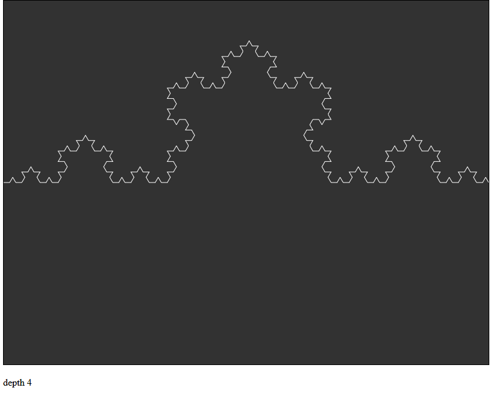

# Koch Recursive P5.js

[Click this to see it live!](https://koch-recursiveJs.greggelong.repl.co)

The koch curve not using L-systems or arrays.

Mouse X changes the level.

I am using rotate and translate to draw the rule

and calling it in a function that recursively calls itself

until the exit condintion is met.

Recursion still seems a bit like magic to me. L-systems that 

create a list of instructions to be drawn are much easier to 

understand.

The exit condition uses a depth counter to keep track of

what level we are on.